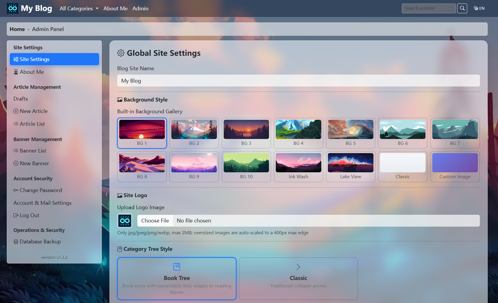

# Blog System Deployment Documentation

Version: v1.3.0

Built with Flask 3.1, it features article publishing and management, Markdown uploads, code highlighting, image uploads, comments and likes, article categories, a banner carousel, and bilingual support (Chinese/English). 
The UI rocks a glassmorphism transparent style with awesome dynamic backgrounds (aurora / starry sky / flowing light / bubbles / classic). There's a floating color palette button at the bottom right to switch styles with one click, and your choice is saved in localStorage. 
All static resources are loaded locally, it supports SQLite and MySQL, and comes with 135 automated tests built in.

<p align="center">
  <a href="https://github.com/jeanslw/MicroBlog/releases/tag/v1.3.0"></a>
  <a href="https://github.com/jeanslw/MicroBlog"></a>
  <a href="https://www.python.org"></a>
  <a href="https://flask.palletsprojects.com"></a>
  <a href="https://github.com/jeanslw/MicroBlog/blob/main/LICENSE"></a>
</p>

> **[Chinese](README_ZH-CN.md)**




---

## 1. Features

| Module | Features |
|--------|----------|
| Article Management | Markdown editor / Markdown article upload, code highlighting (Prism), draft/publish status management |
| Comment Interaction | Article comments, replies, IP spam-like prevention |
| Category Navigation | Article category classification, sidebar category filtering |
| RSS Subscription | RSS 2.0 / Atom subscription |
| Search Function | Full-site article search functionality |
| Banner Carousel | Backend banner management, image upload & sorting |
| Internationalization | Chinese/English auto-switching, follows browser language, dropdown manual switch |
| UI Theme | Glassmorphism transparent UI, 12 built-in 1920x1080 HD background images, one-click switch via floating palette; custom background can be uploaded or set by URL in the admin panel; choice remembered in localStorage |
| Security | CSRF protection, HTML sanitization against XSS (nh3), login brute-force protection, secure sessions, image decompression bomb protection |
| Database | SQLAlchemy ORM, seamless SQLite/MySQL switching |
| Testing | pytest 135 tests covering auth/blog/comments/security/i18n |

## 2. Requirements

| Component | Version | Description |
|-----------|---------|-------------|
| Python | 3.9+ (3.11 recommended) | Runtime |
| MySQL | 5.7+ / 8.0+ (optional) | Production database; SQLite can be used for dev/test instead |
| pip | latest | Python package manager |
| Docker | 20.10+ (optional) | Containerized deployment, no env setup needed |
| Docker Compose | v2+ (optional) | Multi-container orchestration |

> **SQLite mode**: No database installation required, works out of the box.
> **Docker mode**: One command brings up web + db + nginx — see the [Deployment Guide](docs/DEPLOYMENT.md).

## 3. Dependencies

### 3.1 Python Dependencies (requirements.txt)

| Dependency | Version | Purpose |
|------------|---------|---------|
| Flask | 3.1.3 | Web framework |
| Flask-SQLAlchemy | 3.1.1 | ORM and database abstraction |
| Flask-Migrate | 4.0.7 | Database migrations (Alembic wrapper) |
| Flask-WTF | 1.2.1 | Form validation + CSRF protection |
| Flask-Login | 0.6.3 | Session and authentication management |
| Flask-Babel | 4.0.0 | Chinese/English internationalization (i18n) |
| WTForms | 3.2.1 | Form fields and validators |
| email-validator | 2.2.0 | Email field validation |
| PyMySQL | 1.2.0 | MySQL driver |
| cryptography | 43.0.1 | Cryptography library (PyMySQL dependency) |
| gunicorn | 23.0.0 | WSGI server (Docker / Linux production) |
| python-dotenv | 1.2.1 | Loads `.env` files |
| Pillow | 10.4.0 | Image processing (resize/compress/format/protection) |
| nh3 | 0.2.18 | HTML sanitization (XSS prevention, Rust ammonia binding) |
| pytest | 8.3.3 | Testing framework |
| pytest-cov | 5.0.0 | Test coverage |

> uWSGI users can `pip install uwsgi` separately; config file [uwsgi.ini](uwsgi.ini) is provided.

### 3.2 Frontend Static Assets (static/lib/)

All JS/CSS files are localized. **No CDN is required after deployment**, fully usable on intranets.

| File | Size | Purpose |
|------|------|---------|
| `bootstrap.min.css` | 228 KB | Bootstrap 5.3 CSS framework |
| `bootstrap.bundle.min.js` | 79 KB | Bootstrap JS (nav/collapse/carousel) |
| `bootstrap-icons.css` | 94 KB | Bootstrap icon library |
| `easymde.min.js` | 320 KB | Markdown editor |
| `easymde.min.css` | 13 KB | Editor styles |
| `marked.min.js` | 39 KB | Markdown to HTML conversion (v15) |
| `prism.min.js` | 19 KB | Code syntax highlighting |
| `prism-tomorrow.min.css` | 1 KB | Dark code theme |
| `prism-autoloader.min.js` | 6 KB | On-demand language highlighting |

> All `<link>` and `<script>` tags reference local files via `url_for('static', ...)` — zero external links.

## 4. Admin Login & Backend URLs

| Page | URL | Description |
|------|-----|-------------|
| Admin Login | `/admin/login` | Admin login entry point |
| Home | `/` | Article list page |
| New Article | `/article/new` | Login required (Markdown editor) |
| Drafts | `/drafts` | Login required, manage drafts |
| Site Settings | `/admin/site_setting` | Login required, change site name |
| Change Password | `/admin/change_pwd` | Login required |
| Banner Management | `/banner/list` | Login required, manage banners |
| Language Switch | `/set_lang/zh_CN` or `/set_lang/en` | Switch Chinese/English |

**First login steps:**

1. Ensure `BLOG_INIT_ADMIN_PWD` is set
2. After starting the service, visit `http://your-server/admin/login`
3. Log in with `admin` / the password you set
4. **Immediately change to a strong password on the "Change Password" page**

> If `BLOG_INIT_ADMIN_PWD` is not set, no admin is created and a warning appears in startup logs. Set it and restart the service to auto-create.

## 5. Internationalization (i18n)

- Supports Chinese (zh_CN) and English (en)
- **Defaults to browser language**: first visit auto-selects based on browser `Accept-Language`
- **Manual switch**: dropdown in the navbar (right side); selection is saved to session and persists across visits
- Translation files are in the `translations/` directory, managed with Flask-Babel
- After modifying translations, recompile: `pybabel compile -d translations`

## 6. Testing

```bash
# Run all tests
pytest

# Run specific module tests
pytest tests/test_blog.py
pytest tests/test_i18n.py

# View coverage
pytest --cov=app
```

135 tests covering: authentication & brute-force protection, article CRUD, comments & likes, banner management, security (XSS sanitization/CSRF/path validation), i18n language switching, data models, and more.

## 7. Security Features

| Feature | Implementation |
|---------|---------------|
| CSRF Protection | Flask-WTF global CSRF, all POST forms auto-include token |
| XSS Prevention | nh3 whitelist HTML sanitization (raw content stored, sanitized on display) |
| Password Security | Werkzeug pbkdf2:sha256 hash storage |
| Brute-Force Protection | IP + username failure counting with lockout |
| Secure Sessions | HttpOnly + SameSite=Lax + Secure (production) |
| Upload Security | Type/size validation, UUID renaming, double-extension prevention, Pillow decompression bomb protection |
| Hotlink Protection | Nginx valid_referers for `/static/banner/` and `/static/uploads/` |
| Error Hiding | Production mode hides exception traces, returns generic error page |

## 8. Directory Permissions

```bash
# Ensure upload directories are writable
mkdir -p static/banner static/uploads
chmod 755 static/banner static/uploads

# SQLite mode requires writable data/ (auto-created on first startup)
mkdir -p data
chmod 755 data
```
## Related Documentation

| Document | Description |
|----------|-------------|
| [Deployment Guide](docs/DEPLOYMENT.md) | Quick start + full deployment (bare-metal, Docker Compose, HTTPS) |
| [FAQ](docs/FAQ.md) | Frequently asked questions & troubleshooting |
| [Project Architecture](docs/ARCHITECTURE.md) | Codebase structure, entry points & module layout |
| [Contributing Guide](CONTRIBUTING.md) | Bug reporting, code contribution workflow & commit conventions; release rules see [Version Management](CONTRIBUTING.md#5-version-management) |

## Contact
- Issues & PRs: [GitHub Issues](https://github.com/jeanslw/MicroBlog/issues)
- Email: jeanslw@qq.com
