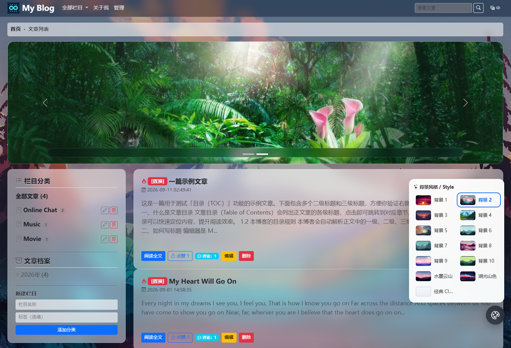

# 博客系统部署文档

版本：v1.2.0

基于 Flask 3.1 框架，功能包括：文章发布与管理、Markdown 编辑器（支持代码高亮与图片上传）、评论与点赞、文章分类、Banner 轮播、中英双语 i18n。整体 UI 采用玻璃拟态透明风格，搭配动态炫酷背景（极光 / 星空 / 流光 / 气泡 / 经典），右下角悬浮调色盘按钮一键自由切换风格，选择记忆在 localStorage 中。全部静态资源本地加载，支持 SQLite 与 MySQL，内置 135 项自动化测试。

> **[英文版](README.md)**



---

## 1. 功能特性

| 模块 | 功能 |
|------|------|
| 文章管理 | Markdown 编辑器（EasyMDE）、代码高亮（Prism）、图片上传自动压缩、草稿/发布状态管理 |
| 评论互动 | 文章评论、回复、IP 防刷点赞 |
| 分类导航 | 文章栏目分类、侧边栏分类筛选 |
| Banner 轮播 | 后台管理轮播图、图片上传与排序 |
| 国际化 | 中英双语自动切换，跟随浏览器语言，下拉框手动切换 |
| UI 主题 | 玻璃拟态透明 UI，动态动画背景（极光/星空/流光/气泡/经典），调色盘一键切换，localStorage 记忆选择 |
| 安全 | CSRF 保护、HTML 净化防 XSS（nh3）、登录防暴力破解、安全 Session、图片解压炸弹防护 |
| 数据库 | SQLAlchemy ORM，SQLite / MySQL 无缝切换 |
| 测试 | pytest 135 项测试，覆盖认证/博客/评论/安全/i18n 等模块 |

## 2. 环境要求

| 组件 | 版本要求 | 说明 |
|------|---------|------|
| Python | 3.9+（推荐 3.11） | 运行环境 |
| MySQL | 5.7+ / 8.0+（可选） | 生产环境数据库，开发/测试可用 SQLite 替代 |
| pip | 最新版 | Python 包管理 |
| Docker | 20.10+（可选） | 容器化部署，免去环境配置 |
| Docker Compose | v2+（可选） | 多容器编排 |

> **SQLite 模式**：无需安装任何数据库，开箱即用，适合开发测试和小型部署。
> **Docker 模式**：见第 6 节，一条命令启动 web + db + nginx。

## 3. 组件依赖

### 3.1 Python 依赖（requirements.txt）

| 依赖 | 版本 | 用途 |
|------|------|------|
| Flask | 3.1.3 | Web 框架 |
| Flask-SQLAlchemy | 3.1.1 | ORM 与数据库抽象层 |
| Flask-Migrate | 4.0.7 | 数据库迁移（Alembic 封装） |
| Flask-WTF | 1.2.1 | 表单校验 + CSRF 保护 |
| Flask-Login | 0.6.3 | 会话与认证管理 |
| Flask-Babel | 4.0.0 | 中英双语国际化（i18n） |
| WTForms | 3.2.1 | 表单字段与验证器 |
| email-validator | 2.2.0 | 邮箱字段校验 |
| PyMySQL | 1.2.0 | MySQL 驱动 |
| cryptography | 43.0.1 | PyMySQL 依赖的加密库 |
| gunicorn | 23.0.0 | WSGI 服务器（Docker / Linux 生产） |
| python-dotenv | 1.2.1 | 从 `.env` 文件读取环境变量 |
| Pillow | 10.4.0 | 图片处理（缩放/压缩/格式转换/解压炸弹防护） |
| nh3 | 0.2.18 | HTML 净化（防 XSS，Rust ammonia 绑定） |
| pytest | 8.3.3 | 测试框架 |
| pytest-cov | 5.0.0 | 测试覆盖率 |

> uWSGI 用户可额外 `pip install uwsgi`，配置文件已提供 [uwsgi.ini](uwsgi.ini)。

### 3.2 前端静态资源（static/lib/）

所有 JS/CSS 均已本地化，**部署后无需访问任何 CDN**，内网完全可用。

| 文件 | 大小 | 用途 |
|------|------|------|
| `bootstrap.min.css` | 228 KB | Bootstrap 5.3 样式框架 |
| `bootstrap.bundle.min.js` | 79 KB | Bootstrap JS（导航/折叠/轮播） |
| `bootstrap-icons.css` | 94 KB | Bootstrap 图标库 |
| `easymde.min.js` | 320 KB | Markdown 编辑器 |
| `easymde.min.css` | 13 KB | 编辑器样式 |
| `marked.min.js` | 39 KB | Markdown → HTML 转换（v15） |
| `prism.min.js` | 19 KB | 代码语法高亮 |
| `prism-tomorrow.min.css` | 1 KB | 代码暗色主题 |
| `prism-autoloader.min.js` | 6 KB | 按需加载编程语言高亮 |

> 页面中所有 `<link>` 和 `<script>` 均使用 `url_for('static', ...)` 引用本地文件，零外链。

## 4. 项目结构

```
MicroBlog/
├── run.py                         # 开发入口
├── wsgi.py                        # WSGI 部署入口
├── uwsgi.ini                      # uWSGI 配置（Linux 裸机部署）
├── Dockerfile                     # Docker 镜像构建
├── docker-compose.yml             # 多容器编排（web + db + nginx）
├── .dockerignore
├── .env.example                   # 裸机环境变量模板
├── .env.docker.example            # Docker Compose 变量模板
├── config.py                      # 配置（密钥/数据库类型/调试/i18n）
├── requirements.txt               # Python 依赖
├── pytest.ini                     # pytest 配置
├── messages.pot                   # Babel 翻译模板
├── data/                          # SQLite 数据库目录（自动创建）
├── nginx/
│   └── nginx.conf                 # Nginx 反代配置（Docker 用）
├── MySQL/
│   └── init.sql                   # MySQL 建表脚本
├── translations/                  # i18n 翻译文件
│   ├── en/LC_MESSAGES/            # 英文（.po 源文件 + .mo 编译文件）
│   └── zh_CN/LC_MESSAGES/         # 中文
├── app/
│   ├── __init__.py                # Flask 应用工厂 + 错误处理 + 全局上下文
│   ├── database.py                # 数据库初始化 + 管理员/站点配置自动创建
│   ├── extensions.py              # db / login_manager / csrf / 日志 / 防爆破
│   ├── models.py                  # SQLAlchemy 数据模型（Admin/Article/Comment 等）
│   ├── forms.py                   # Flask-WTF 表单类（文章/栏目/登录/上传等）
│   ├── utils.py                   # HTML 净化、纯文本提取、图片处理、路径工具
│   ├── blog/                      # 博客模块（浏览/发布/编辑/删除）
│   │   ├── routes.py              # 路由
│   │   └── queries.py             # ORM 查询层
│   ├── admin/                     # 管理员模块（登录/改密/站点设置/图片上传）
│   ├── banner/                    # 轮播图模块（管理/上传）
│   │   ├── routes.py
│   │   └── queries.py
│   ├── comment/                   # 评论与点赞模块
│   └── main/                      # 通用路由（语言切换/robots.txt）
├── templates/                     # Jinja2 模板
│   ├── base.html                  # 公共布局（导航栏/Footer/背景层/风格切换器/i18n 下拉框）
│   ├── error.html                 # 通用错误页（404/500 等）
│   ├── blog/                      # 首页/详情/编辑/草稿箱
│   ├── admin/                     # 登录/改密/站点设置
│   └── banner/                    # 轮播图管理
└── static/
    ├── favicon.ico
    ├── banner/                    # 上传的轮播图（.gitkeep 占位）
    ├── uploads/                   # 上传的文章图片（.gitkeep 占位）
    ├── css/
    │   └── themes.css             # 背景风格 + 玻璃拟态 UI + 风格切换器样式
    ├── js/
    │   └── theme-switcher.js      # 背景风格切换（localStorage 持久化）
    └── lib/                       # 本地第三方库（9 个文件，见 3.2 节）
```

## 5. 快速部署

### 5.1 裸机快速启动（SQLite，3 步到位）

```bash
# 1. 安装依赖
python3 -m venv .venv && source .venv/bin/activate   # Windows: .venv\Scripts\activate
pip install -r requirements.txt

# 2. 配置环境变量
export BLOG_SECRET_KEY="$(python -c 'import secrets;print(secrets.token_hex(32))')"
export BLOG_INIT_ADMIN_PWD='your-strong-password'

# 3. 启动
python run.py
# 访问 http://127.0.0.1:5000，后台 http://127.0.0.1:5000/admin/login
```

### 5.2 Docker 一键启动（推荐生产）

```bash
# 1. 准备变量
cp .env.docker.example .env.docker
# 编辑 .env.docker，填入 BLOG_SECRET_KEY / MYSQL_ROOT_PASSWORD / MYSQL_PASSWORD / BLOG_INIT_ADMIN_PWD

# 2. 启动（web + db + nginx）
docker compose --env-file .env.docker --profile full up -d

# 3. 访问
# 首页：    http://localhost/
# 后台登录：http://localhost/admin/login
```

## 6. 详细部署

### 6.1 获取代码

```bash
git clone https://github.com/jeanslw/MicroBlog.git /opt/MicroBlog
cd /opt/MicroBlog
```

### 6.2 安装 Python 依赖

```bash
python3 -m venv .venv
source .venv/bin/activate   # Linux/Mac
# .venv\Scripts\activate    # Windows

pip install -r requirements.txt
```

### 6.3 配置（通过环境变量）

所有配置通过环境变量注入，**`config.py` 不必修改**。常见变量：

| 变量名 | 默认 | 说明 |
|--------|------|------|
| `BLOG_SECRET_KEY` | （随机生成） | Session/CSRF 密钥；**生产建议显式设置** |
| `BLOG_ENV` | `development` | 设为 `production` 时启用 Secure Cookie |
| `BLOG_DEBUG` | `False` | 调试模式（生产保持 False） |
| `BLOG_DB_TYPE` | `sqlite` | `sqlite` 或 `mysql` |
| `BLOG_MYSQL_HOST` / `BLOG_MYSQL_USER` / `BLOG_MYSQL_PWD` / `BLOG_MYSQL_DB` | - | MySQL 连接信息 |
| `BLOG_SQLITE_PATH` | `data/blog.db` | SQLite 文件路径 |
| `BLOG_PAGE_SIZE` | `6` | 每页文章数 |
| `BLOG_STATIC_MAX_AGE` | `0` | 静态文件缓存秒数 |
| `BLOG_INIT_ADMIN_USER` | `admin` | 首次启动自动创建的管理员账号 |
| `BLOG_INIT_ADMIN_PWD` | （无） | 首次启动自动创建的管理员密码，**未设置则不创建初始管理员** |

Linux 示例：

```bash
export BLOG_ENV=production
export BLOG_SECRET_KEY="$(python -c 'import secrets;print(secrets.token_hex(32))')"
export BLOG_DB_TYPE=sqlite
export BLOG_INIT_ADMIN_USER=admin
export BLOG_INIT_ADMIN_PWD='你的强密码'
```

Windows PowerShell 示例：

```powershell
$env:BLOG_ENV = "production"
$env:BLOG_SECRET_KEY = -join ((48..57)+(65..90)+(97..122) | Get-Random -Count 64 | % {[char]$_})
$env:BLOG_DB_TYPE = "sqlite"
$env:BLOG_INIT_ADMIN_PWD = "你的强密码"
```

#### 方式一：SQLite（推荐开发/测试）

无需额外配置，设置 `BLOG_DB_TYPE=sqlite` 并设置 `BLOG_INIT_ADMIN_PWD`，首次启动自动在 `data/` 目录建表并创建管理员。

#### 方式二：MySQL（推荐生产环境）

1. 安装 MySQL 并创建数据库：

```sql
CREATE DATABASE flask_blog DEFAULT CHARACTER SET utf8mb4 COLLATE utf8mb4_unicode_ci;
```

2. 设置环境变量：

```bash
export BLOG_DB_TYPE=mysql
export BLOG_MYSQL_HOST=localhost
export BLOG_MYSQL_USER=root
export BLOG_MYSQL_PWD='你的MySQL密码'
export BLOG_MYSQL_DB=flask_blog
export BLOG_INIT_ADMIN_PWD='你的管理员密码'
```

3. 导入建表脚本（可选，应用启动时也会自动建表）：

```bash
mysql -u root -p flask_blog < MySQL/init.sql
```

### 6.4 手动建表 SQL（MySQL 用户参考）

直接使用 [`MySQL/init.sql`](MySQL/init.sql)（已通过 STRICT_TRANS_TABLES 严格模式校验，含索引、字符集、字段长度适配）：

```bash
mysql -uroot -p < MySQL/init.sql
```

> ⚠️ **生产环境推荐启用 MySQL 严格模式**（默认已启用），避免数据被静默截断。

**关键字段长度说明**（已在 init.sql 中正确设置，手动建表时切勿缩小）：

| 字段 | 长度 | 原因 |
|------|------|------|
| `admin.password` | VARCHAR(255) | Werkzeug 3.x pbkdf2:sha256:600000 哈希约 102 字符 |
| `banner.img_path` | VARCHAR(500) | 上传路径含 UUID + secure_filename |
| `article.content` | MEDIUMTEXT | 文章正文，TEXT 仅 64KB，MEDIUMTEXT 16MB |
| `article.title` | VARCHAR(500) | 长标题兼容 |

### 6.5 启动服务

**开发/测试：**

```bash
python run.py
# 监听 http://127.0.0.1:5000
```

**生产部署：**

```bash
# 方案一：gunicorn（Linux）
gunicorn -w 4 -b 0.0.0.0:5000 wsgi:application

# 方案二：uWSGI（Linux）
uwsgi --ini uwsgi.ini

# 方案三：waitress（跨平台，Windows 可用）
pip install waitress
waitress-serve --port=5000 wsgi:application
```

### 6.6 Docker Compose 部署（推荐生产）

适合不希望手动配置 Python/MySQL/Nginx 的用户，一条命令拉起全套服务。

#### 6.6.1 服务器准备（首次部署必做）

```bash
# 安装 Docker + Compose 插件
curl -fsSL https://get.docker.com | sh
sudo systemctl enable --now docker
sudo usermod -aG docker $USER   # 免 sudo，需重新登录生效
```

#### 6.6.2 准备变量文件

```bash
cp .env.docker.example .env.docker
vim .env.docker
```

`.env.docker` 关键变量（**必填**）：

| 变量 | 说明 | 示例 |
|------|------|------|
| `BLOG_SECRET_KEY` | Flask Session/CSRF 密钥 | `python -c "import secrets;print(secrets.token_hex(32))"` 生成 |
| `MYSQL_ROOT_PASSWORD` | MySQL root 密码 | 强密码 |
| `MYSQL_PASSWORD` | MySQL 业务账号密码 | 强密码 |
| `BLOG_DB_TYPE` | 数据库类型 | `mysql` 或 `sqlite` |
| `BLOG_INIT_ADMIN_PWD` | 初始管理员密码 | 强密码 |

#### 6.6.3 启动方式

**A. 完整模式（web + db + nginx，推荐生产）**

```bash
docker compose --env-file .env.docker --profile full up -d
```
- 访问：`http://localhost`（nginx 反代，80 端口）
- 直连 Flask：`http://localhost:5000`

**B. 仅 web + db（无 nginx，适合内部/调试）**

```bash
docker compose --env-file .env.docker --profile mysql up -d
```
- 访问：`http://localhost:5000`

**C. 仅 web（SQLite 单容器，最简）**

```bash
# 修改 .env.docker 中 BLOG_DB_TYPE=sqlite
docker compose --env-file .env.docker up -d web --no-deps
```

#### 6.6.4 容器架构

```
┌──────────────────────────────────────────────────┐
│  Host                                            │
│  ┌──────────┐   ┌──────────┐   ┌─────────────┐  │
│  │  nginx   │──▶│   web    │──▶│     db      │  │
│  │  :80     │   │  :5000   │   │  :3306      │  │
│  └──────────┘   └──────────┘   └─────────────┘  │
│       │              │                │          │
│       │              │                ▼          │
│       │              │          ┌──────────┐     │
│       │              │          │  volume  │     │
│       │              │          │ mysql-db │     │
│       │              │          └──────────┘     │
│       │              ▼                            │
│       │         ┌──────────┐                      │
│       │         │ ./data   │ (SQLite 持久化)      │
│       │         │ ./static │ (上传图持久化)        │
│       │         └──────────┘                      │
│       ▼                                            │
│   ./static (静态资源由 nginx 直接提供)             │
└──────────────────────────────────────────────────┘
```

#### 6.6.5 常用运维命令

```bash
# 查看日志
docker compose logs -f web
docker compose logs -f db

# 重启服务
docker compose restart web

# 停止并清理（保留卷）
docker compose down

# 停止并删除数据卷（慎用！清空数据库）
docker compose down -v

# 重新构建镜像（代码改动后）
docker compose build web
docker compose --env-file .env.docker --profile full up -d
```

#### 6.6.6 首次部署检查清单

| 检查项 | 命令 | 期望结果 |
|--------|------|----------|
| 容器状态 | `docker compose --env-file .env.docker --profile full ps` | 3 个 `Up`，web/db 显示 `(healthy)` |
| Web 日志 | `docker compose logs web \| tail -30` | 无 `ERROR`/`Traceback` |
| 首页访问 | `curl -I http://localhost/` | `HTTP/1.1 200` |
| 后台页面 | `curl -I http://localhost/admin/login` | `HTTP/1.1 200` |
| 管理员账号 | `docker exec -i flask-blog-db mysql -uroot -p<密码> flask_blog -e "SELECT count(*) FROM admin"` | `count(*) >= 1` |
| 防火墙 | `sudo ufw status` | 5000/3306 为 DENY |

#### 6.6.7 反代域名与 HTTPS

修改 `nginx/nginx.conf` 中 `server_name _;` 为你的域名，挂载证书后改 443 监听：

```nginx
server {
    listen 443 ssl http2;
    server_name blog.example.com;
    ssl_certificate     /etc/nginx/certs/fullchain.pem;
    ssl_certificate_key /etc/nginx/certs/privkey.pem;
}
```

生产环境**仅开放 80/443**，不要把 5000（Flask）和 3306（MySQL）暴露到公网。

## 7. 管理员登录与后台地址

| 页面 | 地址 | 说明 |
|------|------|------|
| 后台登录 | `/admin/login` | 管理员登录入口 |
| 首页 | `/` | 文章列表页 |
| 新建文章 | `/article/new` | 需登录（Markdown 编辑器） |
| 草稿箱 | `/drafts` | 需登录，管理草稿 |
| 站点设置 | `/admin/site_setting` | 需登录，修改站点名称 |
| 修改密码 | `/admin/change_pwd` | 需登录 |
| 轮播图管理 | `/banner/list` | 需登录，管理 Banner |
| 语言切换 | `/set_lang/zh_CN` 或 `/set_lang/en` | 切换中/英文 |

**首次登录步骤：**

1. 确保 `BLOG_INIT_ADMIN_PWD` 已设置
2. 启动服务后访问 `http://your-server/admin/login`
3. 用 `admin` / 你设置的密码登录
4. **登录后立即在「改密码」页面修改为强密码**

> 若未设置 `BLOG_INIT_ADMIN_PWD`，管理员不会创建，启动日志会有警告。补设后重启服务即可自动补建。

## 8. 国际化（i18n）

- 支持中文（zh_CN）和英文（en）双语
- **默认跟随浏览器语言**：首次访问根据浏览器 `Accept-Language` 自动选择
- **手动切换**：导航栏右侧下拉框，切换后记入 session，后续访问保持选择
- 翻译文件位于 `translations/` 目录，使用 Flask-Babel 管理
- 修改翻译后需重新编译：`pybabel compile -d translations`

## 9. 测试

```bash
# 运行全部测试
pytest

# 运行指定模块测试
pytest tests/test_blog.py
pytest tests/test_i18n.py

# 查看覆盖率
pytest --cov=app
```

测试覆盖 135 项，包括：认证与防暴力、文章 CRUD、评论与点赞、Banner 管理、安全（XSS 净化/CSRF/路径校验）、i18n 语言切换、数据模型等。

## 10. 安全特性

| 特性 | 实现 |
|------|------|
| CSRF 保护 | Flask-WTF 全局 CSRF，所有 POST 表单自动附带 token |
| XSS 防护 | nh3 白名单净化 HTML（文章内容存储原文，展示时净化） |
| 密码安全 | Werkzeug pbkdf2:sha256 哈希存储 |
| 登录防暴力 | IP + 用户名维度失败计数，超限锁定 |
| 安全 Session | HttpOnly + SameSite=Lax + 生产环境 Secure |
| 文件上传安全 | 类型/大小校验、UUID 重命名、防双扩展、Pillow 解压炸弹防护 |
| 图片防盗链 | Nginx valid_referers 规则保护 `/static/banner/` 和 `/static/uploads/` |
| 错误信息隐藏 | 生产模式隐藏异常堆栈，返回通用错误页 |

## 11. 目录权限

```bash
# 上传目录可写
mkdir -p static/banner static/uploads
chmod 755 static/banner static/uploads

# SQLite 模式需要 data 目录可写（首次启动自动创建）
mkdir -p data
chmod 755 data
```

## 12. 常见问题

**Q: 页面样式错乱？**
确认 `static/lib/` 下 9 个文件完整存在，见第 3.2 节列表。

**Q: 数据库连接失败（MySQL）？**
- 确认 MySQL 服务已启动
- 确认环境变量 `BLOG_MYSQL_*` 配置正确
- 确认 `BLOG_DB_TYPE=mysql`
- 确认数据库 `flask_blog` 已创建

**Q: 数据库连接失败（SQLite）？**
- 确认 `BLOG_DB_TYPE=sqlite`
- 确认 `data/` 目录存在且可写
- 删除 `data/blog.db` 后重启可重置数据库

**Q: 如何切换数据库？**
修改 `BLOG_DB_TYPE` 环境变量（`mysql` 或 `sqlite`），代码自动适配，无需改动业务逻辑。

**Q: 管理员账号登录提示密码错误？**
密码通过 `generate_password_hash` 哈希存储，**明文密码无法登录**。重新设置 `BLOG_INIT_ADMIN_PWD` 并重启服务，或在 Python shell 中执行：
```python
from werkzeug.security import generate_password_hash
from app.models import Admin
from app.extensions import db
# 在 app context 中执行
admin = db.session.query(Admin).filter_by(username='admin').first()
admin.password = generate_password_hash('新密码')
db.session.commit()
```

**Q: 改了代码怎么生效？**
- 裸机部署：重启服务（`gunicorn` / `python run.py`）
- Docker 部署：`docker compose build web && docker compose --env-file .env.docker --profile full up -d`
- 模板修改后需清理浏览器缓存

**Q: docker compose 启动报 `must be set in .env.docker`？**
`.env.docker` 没创建或必填变量没填。执行 `cp .env.docker.example .env.docker` 后填入必填变量。

**Q: 首次启动很慢？**
MySQL 首次初始化要 30-60 秒，`db` 容器 `healthy` 后 `web` 才会启动，属正常。可用 `docker compose logs -f db` 观察进度。

**Q: 语言切换不生效？**
确认 `translations/` 目录下有 `.mo` 编译文件。若修改了 `.po` 文件，需执行 `pybabel compile -d translations` 重新编译。

## 联系方式
- 问题与 PR： [GitHub Issues](https://github.com/jeanslw/MicroBlog/issues)
- 邮箱：jeanslw@qq.com
