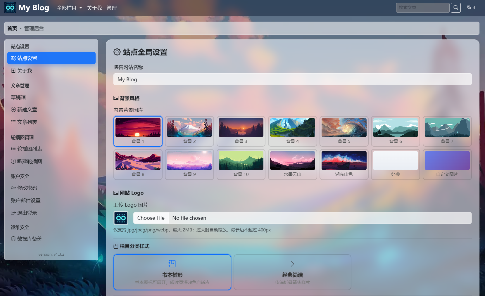

# 博客系统部署文档

版本：v1.3.4

基于 Flask 3.1 框架，功能包括：文章发布与管理、Markdown文档上传、支持代码高亮与图片上传、评论与点赞、文章分类、Banner 轮播、中英双语 i18n。
整体 UI 采用玻璃拟态透明风格，搭配动态炫酷背景（极光 / 星空 / 流光 / 气泡 / 经典），右下角悬浮调色盘按钮一键自由切换风格，选择记忆在 localStorage 中。
全部静态资源本地加载，支持 SQLite 与 MySQL，内置 219 项自动化测试。

<p align="center">
  <a href="https://gitee.com/jeanslw/MicroBlog/releases/tag/v1.3.3"></a>
  <a href="https://gitee.com/jeanslw/MicroBlog"></a>
  <a href="https://www.python.org"></a>
  <a href="https://flask.palletsprojects.com"></a>
  <a href="https://gitee.com/jeanslw/MicroBlog/blob/main/LICENSE"></a>
  <a href="https://hub.docker.com/r/jeanslw/microblog/tags"></a>
</p>

> **[英文版](README.md)**




---

## 1. 功能特性

| 模块 | 功能 |
|------|------|
| 文章管理 | Markdown 编辑器/Markdow文章上传、代码高亮（Prism），草稿/发布状态管理 |
| 评论互动 | 文章评论、回复、IP 防刷点赞 |
| 分类导航 | 文章栏目分类、侧边栏分类筛选 |
| RSS 订阅 | RSS 2.0/Atom 订阅 |
| 搜索功能 | 全站文章搜索功能 |
| Banner 轮播 | 后台管理轮播图、图片上传与排序 |
| 国际化 | 中英双语自动切换，跟随浏览器语言，下拉框手动切换 |
| UI 主题 | 玻璃拟态透明 UI，内置 12 张 1920x1080 高清背景图库，右下角调色盘一键切换；后台可上传或填 URL 自定义背景；localStorage 记忆选择 |
| 安全 | CSRF 保护、HTML 净化防 XSS（nh3）、登录防暴力破解、安全 Session、图片解压炸弹防护 |
| 数据库 | SQLAlchemy ORM，SQLite / MySQL 无缝切换 |
| 测试 | pytest 219 项测试，覆盖认证/博客/评论/安全/i18n 等模块 |

## 2. 环境要求

| 组件 | 版本要求 | 说明 |
|------|---------|------|
| Python | 3.9+（推荐 3.11） | 运行环境 |
| MySQL | 5.7+ / 8.0+（可选） | 生产环境数据库，开发/测试可用 SQLite 替代 |
| pip | 最新版 | Python 包管理 |
| Docker | 20.10+（可选） | 容器化部署，免去环境配置 |
| Docker Compose | v2+（可选） | 多容器编排 |

> **SQLite 模式**：无需安装任何数据库，开箱即用，适合开发测试和小型部署。
> **Docker 模式**：复制配置示例、填写数据库密码后一条命令启动 web + db + nginx，见下方[第 3 节 快速开始](#3-快速开始)。

## 3. 快速开始

### 3.1 Docker Compose（推荐，开箱即用）

只需复制配置示例、填写两个数据库密码，其余保持默认即可启动。

```bash
# 1) 准备配置
cp .env.docker.example .env.docker
#    编辑 .env.docker，至少修改下面两项：
#      MYSQL_ROOT_PASSWORD=你的强密码
#      MYSQL_PASSWORD=你的强密码

# 2) 一键启动 web + MySQL 8 + Nginx
docker compose --env-file .env.docker --profile full up -d

# 3) 浏览器访问
#    站点首页  http://localhost
#    后台入口  http://localhost/admin/login
#    直连调试  http://127.0.0.1:5000
```

三种编排组合（profile）：

| 命令 | 启动的服务 | 适用场景 |
|------|-----------|---------|
| `docker compose up -d web` | 仅 web（SQLite，**零配置、无需密码**） | 最快体验 |
| `docker compose --env-file .env.docker --profile mysql up -d` | web + MySQL | 已有外部反代 |
| `docker compose --env-file .env.docker --profile full up -d` | web + MySQL + Nginx | 完整推荐 |

开箱即用的内置保障：

- **就绪编排**：容器内置 `/healthz` 健康检查（同时探测进程与数据库），web 等 MySQL 首次初始化完成后才启动，Nginx 等 web 健康后才接入流量；应用启动时另有 MySQL 连接重试兜底
- **自动建表建号**：MySQL 首启自动导入 [MySQL/init.sql](MySQL/init.sql)；未配置初始管理员密码时，首访 `/admin/setup` 按引导创建管理员，也可在 `.env.docker` 设置 `BLOG_INIT_ADMIN_PWD` 自动创建
- **HTTP 可直接登录**：内置 Nginx 仅提供明文 HTTP(80)，默认 `BLOG_COOKIE_SECURE=false`；自行配置 HTTPS 后置为 `true`
- **反代头已配好**：默认 `BLOG_PROXY_XFOR=1`、`BLOG_PROXY_XPROTO=1`、`BLOG_PROXY_XHOST=0`
- 默认密钥与默认数据库密码仅供本机测试，**公网部署务必修改** `BLOG_SECRET_KEY`、`MYSQL_ROOT_PASSWORD`、`MYSQL_PASSWORD`
- 数据持久化：SQLite 在 `./data`、上传图片在 `./static`、MySQL 在命名卷 `flask-blog-mysql-data`

常用运维命令：

```bash
docker compose --env-file .env.docker --profile full logs -f web      # 跟踪日志
docker compose --env-file .env.docker --profile full down              # 停止
docker compose --env-file .env.docker --profile full up -d --build     # 代码更新后重建
```

### 3.2 本机直接运行（开发 / 调试）

```bash
python -m venv venv
# Linux / WSL2：
source venv/bin/activate
# Windows：
venv\Scripts\activate
pip install -r requirements.txt

cp .env.example .env     # 编辑 BLOG_SECRET_KEY、BLOG_DB_TYPE、数据库账号等

# Linux / WSL2（gunicorn 多 worker）
gunicorn -w 4 -b 127.0.0.1:5000 --access-logfile - --error-logfile - "app:create_app()"

# Windows（gunicorn 依赖 fork，不支持 Windows，使用 waitress）
waitress-serve --listen=127.0.0.1:5000 wsgi:application
```

访问 `http://127.0.0.1:5000`。经 Nginx 反代时可直接使用 [nginx/nginx.conf](nginx/nginx.conf)（须转发 `Host` 与 `X-Forwarded-*` 头，并在 `.env` 设置 `BLOG_PROXY_XFOR=1`、`BLOG_PROXY_XPROTO=1`；明文 HTTP 调试需 `BLOG_COOKIE_SECURE=false`）。裸机部署与 HTTPS 完整步骤见[部署文档](docs/部署文档.md)。

## 4. 组件依赖

### 4.1 Python 依赖（requirements.txt）

| 依赖 | 版本 | 用途 |
|------|------|------|
| Flask | 3.1.3 | Web 框架 |
| Flask-SQLAlchemy | 3.1.1 | ORM 与数据库抽象层 |
| Flask-Migrate | 4.0.7 | 数据库迁移（Alembic 封装） |
| Flask-WTF | 1.2.1 | 表单校验 + CSRF 保护 |
| Flask-Login | 0.6.3 | 会话与认证管理 |
| Flask-Babel | 4.0.0 | 中英双语国际化（i18n） |
| WTForms | 3.2.1 | 表单字段与验证器 |
| email-validator | 2.2.0 | 邮箱字段校验 |
| PyMySQL | 1.2.0 | MySQL 驱动 |
| cryptography | 43.0.1 | PyMySQL 依赖的加密库 |
| gunicorn | 23.0.0 | WSGI 服务器（Docker / Linux 生产） |
| waitress | 3.0.2 | WSGI 服务器（Windows 本地运行，gunicorn 不支持 Windows） |
| python-dotenv | 1.2.1 | 从 `.env` 文件读取环境变量 |
| Pillow | 10.4.0 | 图片处理（缩放/压缩/格式转换/解压炸弹防护） |
| nh3 | 0.2.18 | HTML 净化（防 XSS，Rust ammonia 绑定） |
| pytest | 8.3.3 | 测试框架 |
| pytest-cov | 5.0.0 | 测试覆盖率 |

> uWSGI 用户可额外 `pip install uwsgi`，配置文件已提供 [uwsgi.ini](uwsgi.ini)。

### 4.2 前端静态资源（static/lib/）

所有 JS/CSS 均已本地化，**部署后无需访问任何 CDN**，内网完全可用。

| 文件 | 大小 | 用途 |
|------|------|------|
| `bootstrap.min.css` | 228 KB | Bootstrap 5.3 样式框架 |
| `bootstrap.bundle.min.js` | 79 KB | Bootstrap JS（导航/折叠/轮播） |
| `bootstrap-icons.css` | 94 KB | Bootstrap 图标库 |
| `font-awesome.min.css` | 31 KB | Font Awesome 4.7 图标（EasyMDE 工具栏） |
| `easymde.min.js` | 320 KB | Markdown 编辑器 |
| `easymde.min.css` | 13 KB | 编辑器样式 |
| `marked.min.js` | 39 KB | Markdown → HTML 转换（v15） |
| `prism.min.js` | 19 KB | 代码语法高亮 |
| `prism-tomorrow.min.css` | 1 KB | 代码暗色主题 |
| `prism-autoloader.min.js` | 6 KB | 按需加载编程语言高亮 |

> 页面中所有 `<link>` 和 `<script>` 均使用 `url_for('static', ...)` 引用本地文件，零外链。
> 图标字体位于 `static/lib/fonts/`（bootstrap-icons、fontawesome-webfont 的 woff2/woff/ttf/svg/eot）。
> EasyMDE 已设置 `autoDownloadFontAwesome: false` 并本地引入 Font Awesome，不会在运行时注入 maxcdn 外链。

## 5. 管理员登录与后台地址

| 页面 | 地址 | 说明 |
|------|------|------|
| 后台登录 | `/admin/login` | 管理员登录入口 |
| 首页 | `/` | 文章列表页 |
| 新建文章 | `/article/new` | 需登录（Markdown 编辑器） |
| 草稿箱 | `/drafts` | 需登录，管理草稿 |
| 站点设置 | `/admin/site_setting` | 需登录，修改站点名称 |
| 修改密码 | `/admin/change_pwd` | 需登录 |
| 轮播图管理 | `/banner/list` | 需登录，管理 Banner |
| 语言切换 | `/set_lang/zh_CN` 或 `/set_lang/en` | 切换中/英文 |

**首次登录步骤（二选一）：**

- 方式一（推荐）：不预设密码，启动服务后访问 `http://your-server/admin/login`，检测到无管理员时会自动跳转 `/admin/setup` 引导页，在页面上创建账号
- 方式二：在 `.env` / `.env.docker` 设置 `BLOG_INIT_ADMIN_PWD`，首次启动自动创建，用 `admin` / 你设置的密码登录

**登录后立即在「改密码」页面修改为强密码。**

> `BLOG_INIT_ADMIN_PWD` 仅在 admin 表为空时生效一次，不会覆盖已有账号；未设置时启动日志会有提示性警告，属正常现象。

## 6. 国际化（i18n）

- 支持中文（zh_CN）和英文（en）双语
- **默认跟随浏览器语言**：首次访问根据浏览器 `Accept-Language` 自动选择
- **手动切换**：导航栏右侧下拉框，切换后记入 session，后续访问保持选择
- 翻译文件位于 `translations/` 目录，使用 Flask-Babel 管理
- 修改翻译后需重新编译：`pybabel compile -d translations`

## 7. 测试

```bash
# 运行全部测试
pytest

# 运行指定模块测试
pytest tests/test_blog.py
pytest tests/test_i18n.py

# 查看覆盖率
pytest --cov=app
```

测试覆盖 219 项，包括：认证与防暴力、文章 CRUD、评论与点赞、Banner 管理、健康检查与 MySQL 就绪等待、安全（XSS 净化/CSRF/Host 白名单/路径校验）、i18n 语言切换、数据模型等。

## 8. 安全特性

| 特性 | 实现 |
|------|------|
| CSRF 保护 | Flask-WTF 全局 CSRF，所有 POST 表单自动附带 token |
| XSS 防护 | nh3 白名单净化 HTML（文章内容存储原文，展示时净化） |
| 密码安全 | Werkzeug pbkdf2:sha256 哈希存储 |
| 登录防暴力 | IP + 用户名维度失败计数，超限锁定 |
| 安全 Session | HttpOnly + SameSite=Lax + 生产环境 Secure |
| 文件上传安全 | 类型/大小校验、UUID 重命名、防双扩展、Pillow 解压炸弹防护 |
| 图片防盗链 | Nginx valid_referers 规则保护 `/static/banner/` 和 `/static/uploads/` |
| 错误信息隐藏 | 生产模式隐藏异常堆栈，返回通用错误页 |

## 9. 目录权限

```bash
# 上传目录可写
mkdir -p static/banner static/uploads
chmod 755 static/banner static/uploads

# SQLite 模式需要 data 目录可写（首次启动自动创建）
mkdir -p data
chmod 755 data
```

## 相关文档

| 文档 | 说明 |
|------|------|
| [部署文档](docs/部署文档.md) | 快速启动 + 完整部署（裸机、Docker Compose、HTTPS） |
| [常见问题](docs/常见问题.md) | 常见问题与排查 |
| [项目架构](docs/项目架构.md) | 代码结构、入口与模块布局 |
| [贡献指南](CONTRIBUTING_ZH-CN.md) | 报告 Bug、代码贡献流程与提交规范；发布规则见[版本管理](CONTRIBUTING_ZH-CN.md#5-版本管理) |


## 联系方式
- 问题与 PR： [GitHub Issues](https://github.com/jeanslw/MicroBlog/issues)
- 邮箱：jeanslw@qq.com
