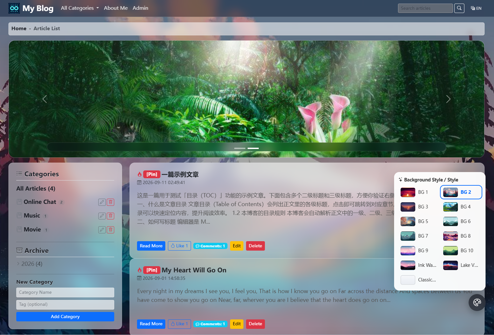

# Blog System Deployment Documentation

Version: v1.2.0

Built on Flask 3.1. Features include: article publishing & management, Markdown editor with code highlighting and image upload, comments & likes, article categories, banner carousel, Chinese/English bilingual i18n. The whole UI uses a glassmorphism transparent style over dynamic animated backgrounds (Aurora / Starry / Flow / Bubbles / Classic) that can be freely switched from a floating palette button, with the choice remembered in localStorage. All static assets are loaded locally. Supports SQLite and MySQL. Includes 135 automated tests.

> **[Chinese](README_ZH-CN.md)**



---

## 1. Features

| Module | Features |
|--------|----------|
| Article Management | Markdown editor (EasyMDE), code highlighting (Prism), image upload with auto-compress, draft/publish status |
| Comments & Likes | Article comments, replies, IP-based like protection |
| Category Navigation | Article categories, sidebar category filter |
| Banner Carousel | Backend banner management, image upload & sorting |
| Internationalization | Chinese/English auto-switching, follows browser language, dropdown manual switch |
| UI Theme | Glassmorphism transparent UI, 12 built-in 1920x1080 HD background images, one-click switch via floating palette; custom background can be uploaded or set by URL in the admin panel; choice remembered in localStorage |
| Security | CSRF protection, HTML sanitization against XSS (nh3), login brute-force protection, secure sessions, image decompression bomb protection |
| Database | SQLAlchemy ORM, seamless SQLite/MySQL switching |
| Testing | pytest 135 tests covering auth/blog/comments/security/i18n |

## 2. Requirements

| Component | Version | Description |
|-----------|---------|-------------|
| Python | 3.9+ (3.11 recommended) | Runtime |
| MySQL | 5.7+ / 8.0+ (optional) | Production database; SQLite can be used for dev/test instead |
| pip | latest | Python package manager |
| Docker | 20.10+ (optional) | Containerized deployment, no env setup needed |
| Docker Compose | v2+ (optional) | Multi-container orchestration |

> **SQLite mode**: No database installation required, works out of the box.
> **Docker mode**: See section 6, one command brings up web + db + nginx.

## 3. Dependencies

### 3.1 Python Dependencies (requirements.txt)

| Dependency | Version | Purpose |
|------------|---------|---------|
| Flask | 3.1.3 | Web framework |
| Flask-SQLAlchemy | 3.1.1 | ORM and database abstraction |
| Flask-Migrate | 4.0.7 | Database migrations (Alembic wrapper) |
| Flask-WTF | 1.2.1 | Form validation + CSRF protection |
| Flask-Login | 0.6.3 | Session and authentication management |
| Flask-Babel | 4.0.0 | Chinese/English internationalization (i18n) |
| WTForms | 3.2.1 | Form fields and validators |
| email-validator | 2.2.0 | Email field validation |
| PyMySQL | 1.2.0 | MySQL driver |
| cryptography | 43.0.1 | Cryptography library (PyMySQL dependency) |
| gunicorn | 23.0.0 | WSGI server (Docker / Linux production) |
| python-dotenv | 1.2.1 | Loads `.env` files |
| Pillow | 10.4.0 | Image processing (resize/compress/format/protection) |
| nh3 | 0.2.18 | HTML sanitization (XSS prevention, Rust ammonia binding) |
| pytest | 8.3.3 | Testing framework |
| pytest-cov | 5.0.0 | Test coverage |

> uWSGI users can `pip install uwsgi` separately; config file [uwsgi.ini](uwsgi.ini) is provided.

### 3.2 Frontend Static Assets (static/lib/)

All JS/CSS files are localized. **No CDN is required after deployment**, fully usable on intranets.

| File | Size | Purpose |
|------|------|---------|
| `bootstrap.min.css` | 228 KB | Bootstrap 5.3 CSS framework |
| `bootstrap.bundle.min.js` | 79 KB | Bootstrap JS (nav/collapse/carousel) |
| `bootstrap-icons.css` | 94 KB | Bootstrap icon library |
| `easymde.min.js` | 320 KB | Markdown editor |
| `easymde.min.css` | 13 KB | Editor styles |
| `marked.min.js` | 39 KB | Markdown to HTML conversion (v15) |
| `prism.min.js` | 19 KB | Code syntax highlighting |
| `prism-tomorrow.min.css` | 1 KB | Dark code theme |
| `prism-autoloader.min.js` | 6 KB | On-demand language highlighting |

> All `<link>` and `<script>` tags reference local files via `url_for('static', ...)` — zero external links.

## 4. Project Structure

```
MicroBlog/
├── run.py                         # Development entry
├── wsgi.py                        # WSGI deployment entry
├── uwsgi.ini                      # uWSGI config (bare-metal Linux)
├── Dockerfile                     # Docker image build
├── docker-compose.yml             # Multi-container orchestration (web + db + nginx)
├── .dockerignore
├── .env.example                   # Bare-metal env vars template
├── .env.docker.example            # Docker Compose vars template
├── config.py                      # Config (secret key / db type / debug / i18n)
├── requirements.txt               # Python dependencies
├── pytest.ini                     # pytest configuration
├── messages.pot                   # Babel translation template
├── data/                          # SQLite database directory (auto-created)
├── nginx/
│   └── nginx.conf                 # Nginx reverse proxy config (for Docker)
├── MySQL/
│   └── init.sql                   # MySQL schema init script
├── translations/                  # i18n translation files
│   ├── en/LC_MESSAGES/            # English (.po source + .mo compiled)
│   └── zh_CN/LC_MESSAGES/         # Chinese
├── app/
│   ├── __init__.py                # Flask app factory + error handling + global context
│   ├── database.py                # DB initialization + admin/site config auto-creation
│   ├── extensions.py              # db / login_manager / csrf / logging / brute-force protection
│   ├── models.py                  # SQLAlchemy models (Admin/Article/Comment etc.)
│   ├── forms.py                   # Flask-WTF form classes (article/category/login/upload etc.)
│   ├── utils.py                   # HTML sanitization, text extraction, image processing, path utils
│   ├── blog/                      # Blog module (browse/publish/edit/delete)
│   │   ├── routes.py              # Routes
│   │   └── queries.py             # ORM query layer
│   ├── admin/                     # Admin module (login/password/site settings/image upload)
│   ├── banner/                    # Banner module (manage/upload)
│   │   ├── routes.py
│   │   └── queries.py
│   ├── comment/                   # Comment & like module
│   └── main/                      # General routes (language switch/robots.txt)
├── templates/                     # Jinja2 templates
│   ├── base.html                  # Common layout (navbar/footer/background layer/theme switcher/i18n dropdown)
│   ├── error.html                 # Generic error page (404/500 etc.)
│   ├── blog/                      # Index/detail/edit/drafts
│   ├── admin/                     # Login/password/site settings
│   └── banner/                    # Banner management
└── static/
    ├── favicon.ico
    ├── banner/                    # Uploaded banner images (.gitkeep placeholder)
    ├── uploads/                   # Uploaded article images (.gitkeep placeholder)
    ├── css/
    │   └── themes.css             # Background library + glassmorphism UI + style switcher
    ├── js/
    │   └── theme-switcher.js      # Background style switching (localStorage persistence)
    ├── backgrounds/               # Built-in background image library (12 HD images)
    └── lib/                       # Local third-party libs (9 files, see 3.2)
```

## 5. Quick Deployment

### 5.1 Bare-Metal Quick Start (SQLite, 3 steps)

```bash
# 1. Install dependencies
python3 -m venv .venv && source .venv/bin/activate   # Windows: .venv\Scripts\activate
pip install -r requirements.txt

# 2. Configure environment
export BLOG_SECRET_KEY="$(python -c 'import secrets;print(secrets.token_hex(32))')"
export BLOG_INIT_ADMIN_PWD='your-strong-password'

# 3. Start
python run.py
# Visit http://127.0.0.1:5000, admin at http://127.0.0.1:5000/admin/login
```

### 5.2 Docker One-Command Start (recommended for production)

```bash
# 1. Prepare variables
cp .env.docker.example .env.docker
# Edit .env.docker: set BLOG_SECRET_KEY / MYSQL_ROOT_PASSWORD / MYSQL_PASSWORD / BLOG_INIT_ADMIN_PWD

# 2. Start (web + db + nginx)
docker compose --env-file .env.docker --profile full up -d

# 3. Access
# Home:  http://localhost/
# Admin: http://localhost/admin/login
```

## 6. Detailed Deployment

### 6.1 Get the Code

```bash
git clone https://github.com/jeanslw/MicroBlog.git /opt/MicroBlog
cd /opt/MicroBlog
```

### 6.2 Install Python Dependencies

```bash
python3 -m venv .venv
source .venv/bin/activate   # Linux/Mac
# .venv\Scripts\activate    # Windows

pip install -r requirements.txt
```

### 6.3 Configuration (via Environment Variables)

All configuration is injected via environment variables — **`config.py` does not need editing**. Common variables:

| Variable | Default | Description |
|----------|---------|-------------|
| `BLOG_SECRET_KEY` | (random) | Session/CSRF secret; **recommended to set explicitly in production** |
| `BLOG_ENV` | `development` | Set to `production` to enable Secure Cookie |
| `BLOG_DEBUG` | `False` | Debug mode (keep False in production) |
| `BLOG_DB_TYPE` | `sqlite` | `sqlite` or `mysql` |
| `BLOG_MYSQL_HOST` / `BLOG_MYSQL_USER` / `BLOG_MYSQL_PWD` / `BLOG_MYSQL_DB` | - | MySQL connection info |
| `BLOG_SQLITE_PATH` | `data/blog.db` | SQLite file path |
| `BLOG_PAGE_SIZE` | `6` | Articles per page |
| `BLOG_STATIC_MAX_AGE` | `0` | Static file cache seconds |
| `BLOG_INIT_ADMIN_USER` | `admin` | Admin username created on first startup |
| `BLOG_INIT_ADMIN_PWD` | (none) | Admin password created on first startup; **if not set, no initial admin is created** |

Linux example:

```bash
export BLOG_ENV=production
export BLOG_SECRET_KEY="$(python -c 'import secrets;print(secrets.token_hex(32))')"
export BLOG_DB_TYPE=sqlite
export BLOG_INIT_ADMIN_USER=admin
export BLOG_INIT_ADMIN_PWD='your-strong-password'
```

Windows PowerShell example:

```powershell
$env:BLOG_ENV = "production"
$env:BLOG_SECRET_KEY = -join ((48..57)+(65..90)+(97..122) | Get-Random -Count 64 | % {[char]$_})
$env:BLOG_DB_TYPE = "sqlite"
$env:BLOG_INIT_ADMIN_PWD = "your-strong-password"
```

#### Option A: SQLite (recommended for dev/test)

No extra config needed. Set `BLOG_DB_TYPE=sqlite` and `BLOG_INIT_ADMIN_PWD`; on first startup the schema is created in `data/` and the admin account is created automatically.

#### Option B: MySQL (recommended for production)

1. Install MySQL and create the database:

```sql
CREATE DATABASE flask_blog DEFAULT CHARACTER SET utf8mb4 COLLATE utf8mb4_unicode_ci;
```

2. Set environment variables:

```bash
export BLOG_DB_TYPE=mysql
export BLOG_MYSQL_HOST=localhost
export BLOG_MYSQL_USER=root
export BLOG_MYSQL_PWD='your-mysql-password'
export BLOG_MYSQL_DB=flask_blog
export BLOG_INIT_ADMIN_PWD='your-admin-password'
```

3. Import schema (optional, app auto-creates tables on startup):

```bash
mysql -u root -p flask_blog < MySQL/init.sql
```

### 6.4 Manual Schema Init SQL (for MySQL users)

Use [`MySQL/init.sql`](MySQL/init.sql) directly (validated with STRICT_TRANS_TABLES strict mode, includes indexes, charset, and field lengths):

```bash
mysql -uroot -p < MySQL/init.sql
```

> ⚠️ **MySQL strict mode is recommended in production** to avoid silent data truncation.

**Key field lengths** (correctly set in init.sql; do not shrink when creating tables manually):

| Field | Length | Reason |
|-------|--------|--------|
| `admin.password` | VARCHAR(255) | Werkzeug 3.x pbkdf2:sha256:600000 hash ~102 chars |
| `banner.img_path` | VARCHAR(500) | Upload path includes UUID + secure_filename |
| `article.content` | MEDIUMTEXT | Article body; TEXT is only 64KB, MEDIUMTEXT is 16MB |
| `article.title` | VARCHAR(500) | Long-title compatibility |

### 6.5 Start the Service

**For dev/test:**

```bash
python run.py
# Listens on http://127.0.0.1:5000
```

**Production options:**

```bash
# Option 1: gunicorn (Linux)
gunicorn -w 4 -b 0.0.0.0:5000 wsgi:application

# Option 2: uWSGI (Linux)
uwsgi --ini uwsgi.ini

# Option 3: waitress (cross-platform, works on Windows)
pip install waitress
waitress-serve --port=5000 wsgi:application
```

### 6.6 Docker Compose Deployment (recommended for production)

#### 6.6.1 Server Preparation (first deployment)

```bash
# Install Docker + Compose plugin
curl -fsSL https://get.docker.com | sh
sudo systemctl enable --now docker
sudo usermod -aG docker $USER   # passwordless docker, requires relogin
```

#### 6.6.2 Prepare the Variables File

```bash
cp .env.docker.example .env.docker
vim .env.docker
```

Required variables in `.env.docker`:

| Variable | Description | Example |
|----------|-------------|---------|
| `BLOG_SECRET_KEY` | Flask Session/CSRF secret | generated via `python -c "import secrets;print(secrets.token_hex(32))"` |
| `MYSQL_ROOT_PASSWORD` | MySQL root password | strong password |
| `MYSQL_PASSWORD` | MySQL app user password | strong password |
| `BLOG_DB_TYPE` | Database type | `mysql` or `sqlite` |
| `BLOG_INIT_ADMIN_PWD` | Initial admin password | strong password |

#### 6.6.3 Startup Modes

**A. Full mode (web + db + nginx, recommended for production)**

```bash
docker compose --env-file .env.docker --profile full up -d
```
- Access: `http://localhost` (via nginx, port 80)
- Direct Flask: `http://localhost:5000`

**B. web + db only (no nginx, for internal/debug)**

```bash
docker compose --env-file .env.docker --profile mysql up -d
```
- Access: `http://localhost:5000`

**C. web only (single SQLite container, simplest)**

```bash
# Edit .env.docker to set BLOG_DB_TYPE=sqlite
docker compose --env-file .env.docker up -d web --no-deps
```

#### 6.6.4 Container Architecture

```
┌──────────────────────────────────────────────────┐
│  Host                                            │
│  ┌──────────┐   ┌──────────┐   ┌─────────────┐  │
│  │  nginx   │──▶│   web    │──▶│     db      │  │
│  │  :80     │   │  :5000   │   │  :3306      │  │
│  └──────────┘   └──────────┘   └─────────────┘  │
│       │              │                │          │
│       │              │                ▼          │
│       │              │          ┌──────────┐     │
│       │              │          │  volume  │     │
│       │              │          │ mysql-db │     │
│       │              │          └──────────┘     │
│       │              ▼                            │
│       │         ┌──────────┐                      │
│       │         │ ./data   │ (SQLite persistence)│
│       │         │ ./static │ (uploads persistence)│
│       │         └──────────┘                      │
│       ▼                                            │
│   ./static (served directly by nginx)             │
└──────────────────────────────────────────────────┘
```

#### 6.6.5 Common Operations

```bash
# View logs
docker compose logs -f web
docker compose logs -f db

# Restart a service
docker compose restart web

# Stop and clean up (keep volumes)
docker compose down

# Stop and delete data volumes (DANGER! wipes database)
docker compose down -v

# Rebuild image (after code changes)
docker compose build web
docker compose --env-file .env.docker --profile full up -d
```

#### 6.6.6 First-Deployment Checklist

| Check | Command | Expected |
|-------|---------|----------|
| Container status | `docker compose --env-file .env.docker --profile full ps` | 3 `Up`, web/db show `(healthy)` |
| Web log | `docker compose logs web \| tail -30` | No `ERROR`/`Traceback` |
| Home access | `curl -I http://localhost/` | `HTTP/1.1 200` |
| Admin page | `curl -I http://localhost/admin/login` | `HTTP/1.1 200` |
| Admin account | `docker exec -i flask-blog-db mysql -uroot -p<PASSWORD> flask_blog -e "SELECT count(*) FROM admin"` | `count(*) >= 1` |
| Firewall | `sudo ufw status` | 5000/3306 DENY |

#### 6.6.7 Reverse Proxy Domain & HTTPS

Change `server_name _;` in `nginx/nginx.conf` to your domain, mount certificates, and switch to 443:

```nginx
server {
    listen 443 ssl http2;
    server_name blog.example.com;
    ssl_certificate     /etc/nginx/certs/fullchain.pem;
    ssl_certificate_key /etc/nginx/certs/privkey.pem;
}
```

In production **only expose 80/443**; do NOT expose 5000 (Flask) or 3306 (MySQL) to the public internet.

## 7. Admin Login & Backend URLs

| Page | URL | Description |
|------|-----|-------------|
| Admin Login | `/admin/login` | Admin login entry point |
| Home | `/` | Article list page |
| New Article | `/article/new` | Login required (Markdown editor) |
| Drafts | `/drafts` | Login required, manage drafts |
| Site Settings | `/admin/site_setting` | Login required, change site name |
| Change Password | `/admin/change_pwd` | Login required |
| Banner Management | `/banner/list` | Login required, manage banners |
| Language Switch | `/set_lang/zh_CN` or `/set_lang/en` | Switch Chinese/English |

**First login steps:**

1. Ensure `BLOG_INIT_ADMIN_PWD` is set
2. After starting the service, visit `http://your-server/admin/login`
3. Log in with `admin` / the password you set
4. **Immediately change to a strong password on the "Change Password" page**

> If `BLOG_INIT_ADMIN_PWD` is not set, no admin is created and a warning appears in startup logs. Set it and restart the service to auto-create.

## 8. Internationalization (i18n)

- Supports Chinese (zh_CN) and English (en)
- **Defaults to browser language**: first visit auto-selects based on browser `Accept-Language`
- **Manual switch**: dropdown in the navbar (right side); selection is saved to session and persists across visits
- Translation files are in the `translations/` directory, managed with Flask-Babel
- After modifying translations, recompile: `pybabel compile -d translations`

## 9. Testing

```bash
# Run all tests
pytest

# Run specific module tests
pytest tests/test_blog.py
pytest tests/test_i18n.py

# View coverage
pytest --cov=app
```

135 tests covering: authentication & brute-force protection, article CRUD, comments & likes, banner management, security (XSS sanitization/CSRF/path validation), i18n language switching, data models, and more.

## 10. Security Features

| Feature | Implementation |
|---------|---------------|
| CSRF Protection | Flask-WTF global CSRF, all POST forms auto-include token |
| XSS Prevention | nh3 whitelist HTML sanitization (raw content stored, sanitized on display) |
| Password Security | Werkzeug pbkdf2:sha256 hash storage |
| Brute-Force Protection | IP + username failure counting with lockout |
| Secure Sessions | HttpOnly + SameSite=Lax + Secure (production) |
| Upload Security | Type/size validation, UUID renaming, double-extension prevention, Pillow decompression bomb protection |
| Hotlink Protection | Nginx valid_referers for `/static/banner/` and `/static/uploads/` |
| Error Hiding | Production mode hides exception traces, returns generic error page |

## 11. Directory Permissions

```bash
# Ensure upload directories are writable
mkdir -p static/banner static/uploads
chmod 755 static/banner static/uploads

# SQLite mode requires writable data/ (auto-created on first startup)
mkdir -p data
chmod 755 data
```

## 12. FAQ

**Q: Page styles broken?**
Confirm all 9 files in `static/lib/` exist (see section 3.2).

**Q: Database connection failed (MySQL)?**
- Confirm MySQL service is running
- Confirm `BLOG_MYSQL_*` environment variables are correct
- Confirm `BLOG_DB_TYPE=mysql`
- Confirm database `flask_blog` exists

**Q: Database connection failed (SQLite)?**
- Confirm `BLOG_DB_TYPE=sqlite`
- Confirm `data/` directory exists and is writable
- Delete `data/blog.db` and restart to reset the database

**Q: How to switch databases?**
Change `BLOG_DB_TYPE` environment variable (`mysql` or `sqlite`); code adapts automatically.

**Q: Admin login says password is wrong?**
Passwords are stored as `generate_password_hash` hashes — **plaintext passwords cannot log in**. Reset `BLOG_INIT_ADMIN_PWD` and restart, or in a Python shell:
```python
from werkzeug.security import generate_password_hash
from app.models import Admin
from app.extensions import db

# Execute within app context
admin = db.session.query(Admin).filter_by(username="admin").first()
admin.password = generate_password_hash("new-password")
db.session.commit()
```

**Q: How to apply code changes?**
- Bare-metal: restart the service (`gunicorn` / `python run.py`)
- Docker: `docker compose build web && docker compose --env-file .env.docker --profile full up -d`
- Clear browser cache after template changes

**Q: `docker compose` startup fails with `must be set in .env.docker`?**
`.env.docker` was not created or required vars are missing. Run `cp .env.docker.example .env.docker`, then fill in required variables.

**Q: First startup is slow?**
MySQL initial setup takes 30–60s; `web` only starts after `db` becomes `healthy`. Use `docker compose logs -f db` to watch progress.

**Q: Language switch not working?**
Confirm `.mo` compiled files exist in `translations/`. If `.po` files were modified, run `pybabel compile -d translations` to recompile.

## Contact
- Issues & PRs: [GitHub Issues](https://github.com/jeanslw/MicroBlog/issues)
- Email: jeanslw@qq.com